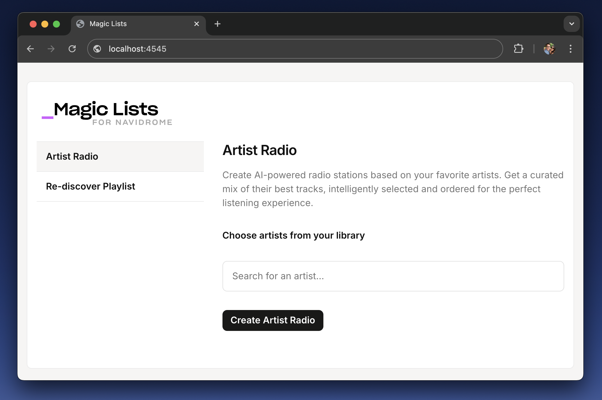

# MagicLists - Navidrome MVP

A FastAPI web application that integrates with Navidrome to create AI-powered playlists from your music library.

## Features

- 🎵 Browse artists from your Navidrome library
- 📝 Create custom playlists for any artist
- 🤖 AI-powered playlist generation (optional)
- 🔄 **Re-Discover Weekly** - Find tracks you loved but haven't heard recently
- 💾 SQLite database for playlist storage
- 🐳 Docker support for easy deployment

## Screenshots



_Caption: Creating an Artist Radio playlist _ 

## Project Structure

```
magiclists-navidrome-mvp/
├── backend/
│   ├── main.py              # FastAPI entrypoint
│   ├── navidrome_client.py  # Navidrome API client
│   ├── ai_client.py         # AI integration
│   ├── database.py          # SQLite database manager
│   └── schemas.py           # Pydantic models
├── frontend/
│   ├── templates/
│   │   └── index.html       # Main web interface
│   └── static/
│       └── style.css        # CSS styles
├── docker/
│   ├── Dockerfile           # Container configuration
│   └── docker-compose.yml   # Multi-service setup
├── requirements.txt         # Python dependencies
└── README.md               # This file
```

## Quick Start

### Option 1: Running with Docker (Recommended)

1. **Clone the repository:**
   ```bash
   git clone <repository-url>
   cd magiclists-navidrome-mvp
   ```

2. **Create your environment file:**
   ```bash
   cp .env.example .env
   ```

3. **Configure your `.env` file with your Navidrome details:**
   ```bash
   # Required - Your Navidrome server details
   NAVIDROME_URL=https://your-navidrome-server.com
   NAVIDROME_USERNAME=your_username
   NAVIDROME_PASSWORD=your_password
   
   # Optional - AI features (see AI Configuration section below)
   AI_API_KEY=your_api_key_here
   AI_MODEL=openai/gpt-3.5-turbo
   ```

4. **Start the application:**
   ```bash
   docker-compose up --build
   ```

5. **Access the application:**
   - Open http://localhost:4545 in your browser
   - The app will connect to your Navidrome server using the credentials in `.env`

**That's it!** The application will be running in a Docker container with all dependencies included.

### Option 2: Local Development (Advanced)

1. **Install dependencies:**
   ```bash
   pip install -r requirements.txt
   ```

2. **Set environment variables:**
   ```bash
   export NAVIDROME_URL=http://localhost:4533
   export NAVIDROME_TOKEN=your_navidrome_api_token
   export AI_API_KEY=your_openai_api_key  # Optional
   export AI_MODEL=gpt-3.5-turbo  # Optional
   ```

3. **Run the application:**
   ```bash
   cd magiclists-navidrome-mvp
   python -m uvicorn backend.main:app --reload --host 0.0.0.0 --port 8000
   ```

## API Endpoints

- `GET /` - Web interface
- `GET /api/artists` - List all artists from Navidrome
- `POST /api/create_playlist` - Create a new playlist
  ```json
  {
    "artist_id": "artist_123",
    "playlist_name": "My Favorite Songs"
  }
  ```
- `GET /api/rediscover-weekly` - Generate Re-Discover Weekly recommendations
- `POST /api/create-rediscover-playlist` - Create Re-Discover Weekly playlist in Navidrome

## Re-Discover Weekly Feature

The **Re-Discover Weekly** feature analyzes your Navidrome listening history to find tracks you've loved but haven't heard recently:

- 📊 **Analyzes last 30 days** of listening history
- 🎯 **Finds forgotten favorites** - tracks with high play counts but not played in 7+ days
- 🧮 **Smart scoring** - ranks tracks by `(play count × days since last play)`
- 🎨 **Artist diversity** - limits each artist to maximum 3 tracks
- 📝 **Top 20 tracks** - returns the highest-scored tracks as a playlist
- ⚡ **Lightweight** - no embedding libraries, just play counts and dates

Simply click "Generate Re-Discover Weekly" in the web interface to discover tracks you might want to hear again!

## Configuration

### AI Configuration (Optional)

The AI features enhance playlist curation with intelligent track selection. You can choose from free, low-cost, or premium models:

**Getting an API Key:**
- **[OpenRouter](https://openrouter.ai)** - Provides access to many models with free tiers

**Model Options:**
- **Free/Low-cost**: `deepseek/deepseek-chat`, `google/gemini-flash-1.5`, `meta-llama/llama-3.1-8b-instruct:free`
- **Paid**: `openai/gpt-3.5-turbo`, `openai/gpt-4o-mini`, `anthropic/claude-3-haiku`

**Example `.env` setup:**
```bash
# For OpenRouter (free tier available)
AI_API_KEY=sk-or-v1-your-key-here
AI_MODEL=deepseek/deepseek-chat

# For OpenAI direct
AI_API_KEY=sk-your-openai-key
AI_MODEL=openai/gpt-3.5-turbo
```

**Note:** Without AI configuration, the app falls back to play-count based playlist generation.

### Environment Variables

| Variable | Description | Required |
|----------|-------------|----------|
| `NAVIDROME_URL` | Navidrome server URL | Yes |
| `NAVIDROME_USERNAME` | Navidrome username | Yes |
| `NAVIDROME_PASSWORD` | Navidrome password | Yes |
| `NAVIDROME_API_KEY` | Navidrome API key (future feature) | No |
| `AI_API_KEY` | OpenRouter API key for AI curation | No |
| `AI_MODEL` | AI model name (default: openai/gpt-3.5-turbo) | No |
| `DATABASE_PATH` | SQLite database file path | No |

### Navidrome Setup

1. Install and configure Navidrome on your system
2. Point Navidrome to your music library
3. Create a user account
4. Use these credentials in the MagicLists configuration

## Development

### Project Dependencies

- **FastAPI**: Web framework and API
- **httpx**: HTTP client for Navidrome API
- **aiosqlite**: Async SQLite database
- **Pydantic**: Data validation and schemas
- **Jinja2**: HTML templating
- **uvicorn**: ASGI server

### Adding Features

1. **New API endpoints**: Add to `backend/main.py`
2. **Database changes**: Modify `backend/database.py`
3. **Frontend updates**: Edit `frontend/templates/index.html`
4. **Styling**: Update `frontend/static/style.css`

## Troubleshooting

### Common Issues

1. **Navidrome connection failed**
   - Check `NAVIDROME_URL` is correct
   - Verify Navidrome is running
   - Confirm username/password are valid

2. **No artists found**
   - Ensure your music library is scanned in Navidrome
   - Check Navidrome logs for scanning issues

3. **Database errors**
   - Ensure write permissions for database directory
   - Check disk space

## License

MIT License - see LICENSE file for details.

## Contributing

1. Fork the repository
2. Create a feature branch
3. Make your changes
4. Add tests if applicable
5. Submit a pull request

## 📈 Usage Analytics

This project uses [Umami Analytics](https://umami.is/) to anonymously measure feature usage (no cookies, no personal data are stored).

You can view the **public dashboard here:** [magic-lists analytics](https://umami.itsricky.com/share/kg0XvYPeMM3UsqhO/magic-lists.local)

## Support

For issues and questions:
- Check the troubleshooting section
- Review Navidrome documentation
- Create an issue in the repository

---

© 2025 Synnot Studio — Licensed under the MIT License.

Made with ❤️ by [Synnot Studio](https://synnotstudio.com).