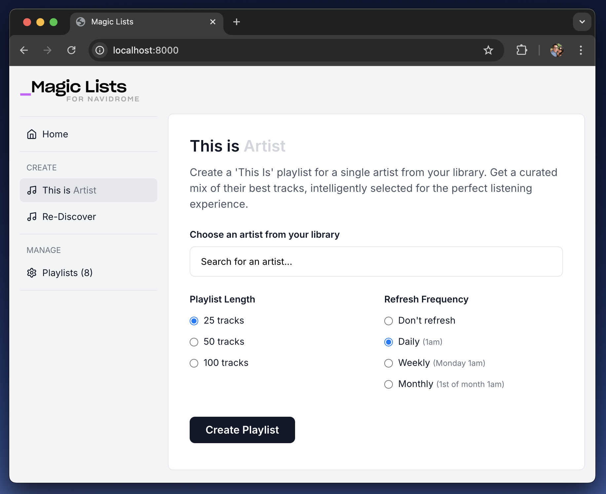

# MagicLists for Navidrome

**AI-assisted playlists for your own music library.**

MagicLists adds the kind of curated, evolving playlists you’d expect from Spotify or Apple Music—except it works entirely on your self-hosted Navidrome server. No subscriptions, no renting your music back. Just smart mixes generated from the library you already own.

## What it does
- 🎵 **This Is (Artist)** — Builds a definitive playlist for any artist in your library, combining hits, deep cuts, and featured appearances without duplicates.
- 🔄 **Re-Discover** — Rotates tracks you haven’t played in a while, helping you fall back in love with your collection.
- ⏰ **Auto-Refresh** — Keep playlists fresh with daily, weekly, or monthly updates.
- 🐳 **Quick Setup** — Simple Docker install; get started in minutes.

## Why it matters
Navidrome users already own their music. MagicLists brings modern curation tools into that world—so your playlists feel alive, not static, and your collection keeps surprising you.

## Who’s behind it
I’m Ricky, a product designer with 20+ years in tech. I’m building MagicLists feature by feature, from UI and CSS to playlist logic, because I’m passionate about open-source, privacy-friendly music tools. This isn’t vaporware or a throwaway experiment—it’s genuine, ongoing research into how AI can enrich personal music libraries.

## What’s next
Upcoming experiments include:
- Multi-artist “radio” blends
- Decade and discovery-focused lists
- Creative journeys like The Long Way Home (a track-to-track sonic path) and Genre Archaeology (tracing influences backwards through time).

MagicLists is just getting started, and I’d love your feedback as it grows.

## Screenshots


_Caption: Creating a 'This is (Artist)' playlist_ 


## Installation

### Recommended: Add to Your Existing Docker Compose

**Why this method?** Your MagicLists container will be on the same network as Navidrome, making connection simple and reliable. This also enables future features like audio analysis that require local file access.

1. **Add MagicLists to your existing `docker-compose.yml`** (the one that runs Navidrome):
```yaml
   services:
     navidrome:
       # ... your existing Navidrome config ...
     
     magiclists:
       image: rickysynnot/magic-lists-for-navidrome:latest
       container_name: magiclists
       ports:
         - "4545:8000"
       environment:
         - NAVIDROME_URL=http://navidrome:4533
         - NAVIDROME_USERNAME=your_username
         - NAVIDROME_PASSWORD=your_password
         - DATABASE_PATH=/app/data/magiclists.db # Required: Database location
         - AI_PROVIDER=groq                    # Optional: groq, ollama, or openrouter
         - AI_API_KEY=your_groq_api_key        # Optional, for Groq/OpenRouter
         - AI_MODEL=llama-3.1-8b-instant       # Optional, for AI providers
       volumes:
         - ./magiclists-data:/app/data          # Persist configuration
       restart: unless-stopped
```
2. Update the environment variables with your Navidrome credentials
3. Start the stack:
```bash
   docker-compose up -d
```
4. Access MagicLists at http://localhost:4545

Note: The NAVIDROME_URL uses the container name (navidrome) as the hostname. If your Navidrome service has a different name in your compose file, update this accordingly.

### Alternative: Standalone Docker Container
Use this if you can't or don't want to modify your existing Docker Compose setup.

**If Navidrome is publicly accessible:**
Use your public Navidrome URL (e.g., https://music.yourdomain.com):
```bash
   docker run -d \
      --name magiclists \
      -p 4545:8000 \
      -e NAVIDROME_URL=https://music.yourdomain.com \
      -e NAVIDROME_USERNAME=your_username \
      -e NAVIDROME_PASSWORD=your_password \
      -e DATABASE_PATH=/app/data/magiclists.db \
      -e AI_PROVIDER=groq \
      -e AI_API_KEY=your_groq_api_key \
      -v ./magiclists-data:/app/data \
      rickysynnot/magic-lists-for-navidrome:latest
```

**If Navidrome is on the same host machine:**
Use host.docker.internal to reach services on your host:
```bash
   docker run -d \
      --name magiclists \
      -p 4545:8000 \
      -e NAVIDROME_URL=http://host.docker.internal:4533 \
      -e NAVIDROME_USERNAME=your_username \
      -e NAVIDROME_PASSWORD=your_password \
      -e DATABASE_PATH=/app/data/magiclists.db \
      -e AI_PROVIDER=groq \
      -e AI_API_KEY=your_groq_api_key \
      -v ./magiclists-data:/app/data \
      rickysynnot/magic-lists-for-navidrome:latest
```
**If Navidrome is on your local network:**
Use the local IP address of the machine running Navidrome:
```bash
   docker run -d \
      --name magiclists \
      -p 4545:8000 \
      -e NAVIDROME_URL=http://192.168.1.100:4533 \
      -e NAVIDROME_USERNAME=your_username \
      -e NAVIDROME_PASSWORD=your_password \
      -e DATABASE_PATH=/app/data/magiclists.db \
      -e AI_PROVIDER=groq \
      -e AI_API_KEY=your_groq_api_key \
      -v ./magiclists-data:/app/data \
      rickysynnot/magic-lists-for-navidrome:latest
```
Access MagicLists at http://localhost:4545

## Running Without Docker
Use this method if you prefer to run Python directly or want to contribute to development.

1. Clone the repository:
```bash
   git clone https://github.com/rsynnot/magic-lists-for-navidrome.git
   cd magic-lists-for-navidrome
```
2. Install dependencies:
```bash
   pip install -r requirements.txt
```
3. Create your environment file:
```bash
   cp .env.example .env
```
4. Edit `.env` with your Navidrome details:
```bash
   NAVIDROME_URL=http://localhost:4533
   NAVIDROME_USERNAME=your_username
   NAVIDROME_PASSWORD=your_password
   DATABASE_PATH=./magiclists.db        # Required: Database location
   AI_PROVIDER=groq                    # Optional: groq, ollama, or openrouter
   AI_API_KEY=your_groq_api_key        # Optional, for Groq/OpenRouter
   AI_MODEL=llama-3.1-8b-instant       # Optional, for AI providers
```
5. Run the application:
```bash
    python -m uvicorn app.main:app --host 0.0.0.0 --port 4545
```
6. Access the application at http://localhost:4545
To update: Simply `git pull` and restart the application.

## Troubleshooting

### Database Write Errors (500 Server Error)
If system checks pass but playlist creation fails with a 500 error about database write permissions:

**Solution**: Ensure `DATABASE_PATH` environment variable is set:
- **Docker**: `DATABASE_PATH=/app/data/magiclists.db` (with volume mounted to `/app/data`)
- **Standalone**: `DATABASE_PATH=./magiclists.db` (in your project directory)

This is **required** for the application to persist playlist data and user settings.

### Connection Issues

Can't connect to Navidrome? The most common issue is an incorrect `NAVIDROME_URL`. Here's how to determine the right value:
- Same Docker network: Use the container name (e.g., http://navidrome:4533)
- Same host machine: Use http://host.docker.internal:4533 (Docker Desktop) or http://172.17.0.1:4533 (Linux)
- Different machine on LAN: Use the local IP (e.g., http://192.168.1.100:4533)
- Public internet: Use your domain (e.g., https://music.yourdomain.com)

**Check if containers are on the same network:**
```bash
   # List Docker networks
   docker network ls

   # Inspect your network
   docker network inspect your_network_name

   # Verify both containers are on the same network
   docker ps --format "table {{.Names}}\t{{.Networks}}"
```

**No artists found**
   - Ensure your music library is scanned in Navidrome
   - Check Navidrome logs for scanning issues
   - If using multiple libraries, verify the library ID is correct

**Database errors**
   - Ensure write permissions for database directory
   - Check disk space
   - Restart the application if database appears corrupted

**Still having issues?** Check the System Check page in the app after startup - it will test your connection and provide specific guidance.


## System Check Page 

MagicLists automatically validates your configuration on startup. If any issues are detected, you'll be redirected to a system check page that shows:

- **Environment Variables**: Checks that required variables are set
- **Navidrome URL**: Verifies your server is reachable  
- **Navidrome Authentication**: Tests your credentials
- **Navidrome Artists API**: Confirms API access is working
- **AI Provider**: Checks if AI features are configured (Groq, Ollama, or OpenRouter)
- **Library Configuration**: Shows multiple library setup status

If checks fail, detailed suggestions are provided to help resolve issues. You can also access the system check at any time via `/system-check`.

## API Endpoints

- `GET /` - Web interface
- `GET /api/artists` - List all artists from Navidrome
- `POST /api/create_playlist` - Create a new "This Is" playlist
- `POST /api/create_playlist_with_reasoning` - Create playlist with detailed reasoning
- `GET /api/rediscover-weekly` - Generate Re-Discover Weekly recommendations
- `POST /api/create-rediscover-playlist` - Create Re-Discover Weekly playlist in Navidrome
- `GET /api/playlists` - List all managed playlists
- `DELETE /api/playlists/{playlist_id}` - Delete a managed playlist
- `GET /api/recipes` - List available recipe versions
- `GET /api/recipes/validate` - Validate recipe configurations
- `GET /api/scheduler/status` - Check auto-refresh scheduler status
- `POST /api/scheduler/trigger` - Manually trigger scheduled refreshes
- `POST /api/scheduler/start` - Start the auto-refresh scheduler


## AI Configuration (Optional)

MagicLists supports multiple AI providers for enhanced playlist curation:

1. **Fallback-only** (Free) - Uses play count and metadata sorting
2. **Groq** (Free) - Fast cloud models with no credit card required
3. **Local LLM** (Free) - Run models locally with Ollama
4. **OpenRouter Free Models** (Free) - Access to free cloud models
5. **OpenRouter Premium Models** (Paid) - Higher quality cloud models

### Option 1: Groq (Recommended - Fast & Free)
Get a free API key from [Groq](https://console.groq.com/) - no credit card required:

```bash
# .env configuration
AI_PROVIDER=groq
AI_API_KEY=gsk_your-groq-key-here
AI_MODEL=llama-3.1-8b-instant           # Fast default model
# AI_MODEL=mixtral-8x7b-32768           # Alternative model
```

### Option 2: Ollama (Local Models)
[Install Ollama](https://ollama.com) and run models locally:

```bash
# Install and run a model
ollama pull llama3.2
ollama serve

# .env configuration
AI_PROVIDER=ollama
AI_MODEL=llama3.2
OLLAMA_BASE_URL=http://localhost:11434/v1/chat/completions
# For Docker: OLLAMA_BASE_URL=http://host.docker.internal:11434/v1/chat/completions
# OLLAMA_TIMEOUT=300  # Increase for slower CPUs (default: 180 seconds)
```

### Option 3: OpenRouter (Cloud Models)
Get an API key from [OpenRouter](https://openrouter.ai) ($5 minimum):

```bash
# .env configuration
AI_PROVIDER=openrouter
AI_API_KEY=sk-or-v1-your-key-here
AI_MODEL=deepseek/deepseek-chat         # Free model
# AI_MODEL=anthropic/claude-3-haiku     # Paid model
```

**Note:** Without AI configuration, the app falls back to play-count based playlist generation.


## Multiple Navidrome Libraries
   
If you have multiple music libraries in Navidrome:

- **Automatic**: MagicLists will detect and work with all libraries by default
- **Specific Library**: Set `NAVIDROME_LIBRARY_ID` to target a specific library:
   ```bash
   NAVIDROME_LIBRARY_ID=your-library-id-here
   ```
- **Find Library IDs**: Check your Navidrome admin interface or API documentation
- **System Check**: The health check will show library configuration status

## License

MIT License - see LICENSE file for details.

## Contributing

1. Fork the repository
2. Create a feature branch
3. Make your changes
4. Add tests if applicable
5. Submit a pull request

## 📈 Usage Analytics

This project uses [Umami Analytics](https://umami.is/) to anonymously measure feature usage (no cookies, no personal data are stored).

You can view the **public dashboard here:** [magic-lists analytics](https://umami.itsricky.com/share/kg0XvYPeMM3UsqhO/magic-lists.local)

## Support

For issues and questions:
- Check the troubleshooting section
- Review Navidrome documentation
- Create an issue in the repository

## Legal Disclaimer

**No Warranty**: This software is provided "as is" without warranty of any kind, express or implied.

**User Responsibility**: You are solely responsible for:
- Ensuring you have proper rights to any music content processed through this application
- Any data transmitted to third-party AI services
- Backup of your music library before use
- Any modifications made to your playlists or library

**Limitation of Liability**: The developers shall not be liable for any damages including but not limited to data loss, corruption of music libraries, or any other direct or indirect damages arising from use of this software.

**Third-party Services**: This application integrates with external AI services. Your use of these services is subject to their respective terms of service.

By using this software, you acknowledge and accept these terms. 

---

© 2025 Made by [Synnot Studio](https://synnotstudio.com) — Licensed under the MIT License.